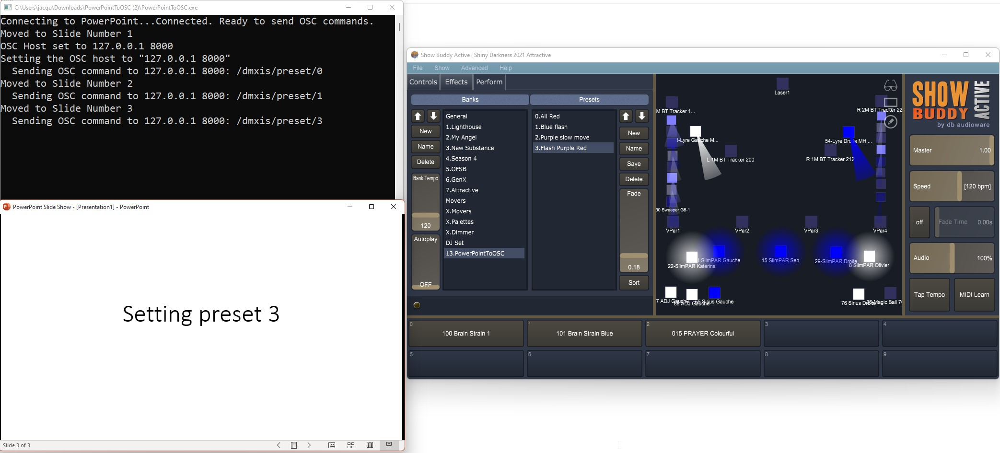

# PowerPointToOSC

A .NET core application to send [OSC commands](http://cnmat.org/OpenSoundControl/OSC-spec.html) based on the content of PowerPoint's slides speaker notes.

I use it to control a lighting rig, itself controlled by DMX, while I present my slides.
The USB to DMX interface I use is [DMXIS](https://www.dmxis.com/) from ENTTEC. Either DMXIS or ShowBuddyActive can be controlled by OSC.



PowerPointToOSC is based on [PowerPointToOBSSceneSwitcher](https://github.com/shanselman/PowerPointToOBSSceneSwitcher) which allows to select OBS scenes based on the content of slides speaker notes. There is no OBS support in PowerPointToOSC, which is only focused on OSC.

## Usage

* Download the latest version from [GitHub](https://github.com/ojacques/PowerPointToOSC/releases)
* Extract the zip file in a folder of your choice
* Start `PowerPointToOSC.exe`
* In the speaker notes of the first slide, configure the OSC host to send OSC commands with the `OSCHOST` verb, in the form of "`IP port`":

```
OSCHOST:127.0.0.1 5678
```

By default, `OSCHOST` is set to `127.0.0.1 8000`.

* In the speaker notes of any slide, send OSC commands:

Example:
```<language>
OSC: /dmxis/preset/1
OSC: /test1 i 123.45
OSC: /test2 f 123.45
OSC: /test3 s teststring
OSC: /test4 b true
```

For DMXIS, refer to [this manual](https://dol2kh495zr52.cloudfront.net/pdf/manuals/200405_DMXIS_v1.70_UM.pdf) for OSC commands. For ShowBuddyActive, refer to [this manual](https://www.dmxis.com/release/SBA/Show%20Buddy%20Active.pdf).

PowerPointToOSC relies on [sendosc](https://github.com/yoggy/sendosc) command line. The same syntax applies.

## TODO

- Support per click OSC commands (see App_SlideShowNextClick) within the same slide
- Remove sendosc.exe dependency and send direct OSC packets leveraging UDP. [Spec](http://cnmat.org/OpenSoundControl/OSC-spec.html). Boiler plate code:
```csharp
        static void SendUdp(int srcPort, string dstIp, int dstPort, byte[] data)
        {
            using (UdpClient c = new UdpClient(srcPort))
                c.Send(data, data.Length, dstIp, dstPort);
        }

        public static void PadNull(List<byte> data)
        {
            byte zero = 0;
            int pad = 4 - (data.Count % 4);
            for (int i = 0; i < pad; i++)
            {
                data.Add(zero);
            }
        }
        
        SendUdp(8000, "127.0.0.1", 8000, Encoding.ASCII.GetBytes(oscString));
```
